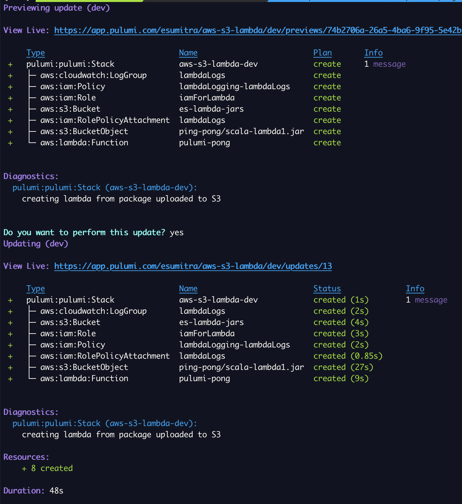
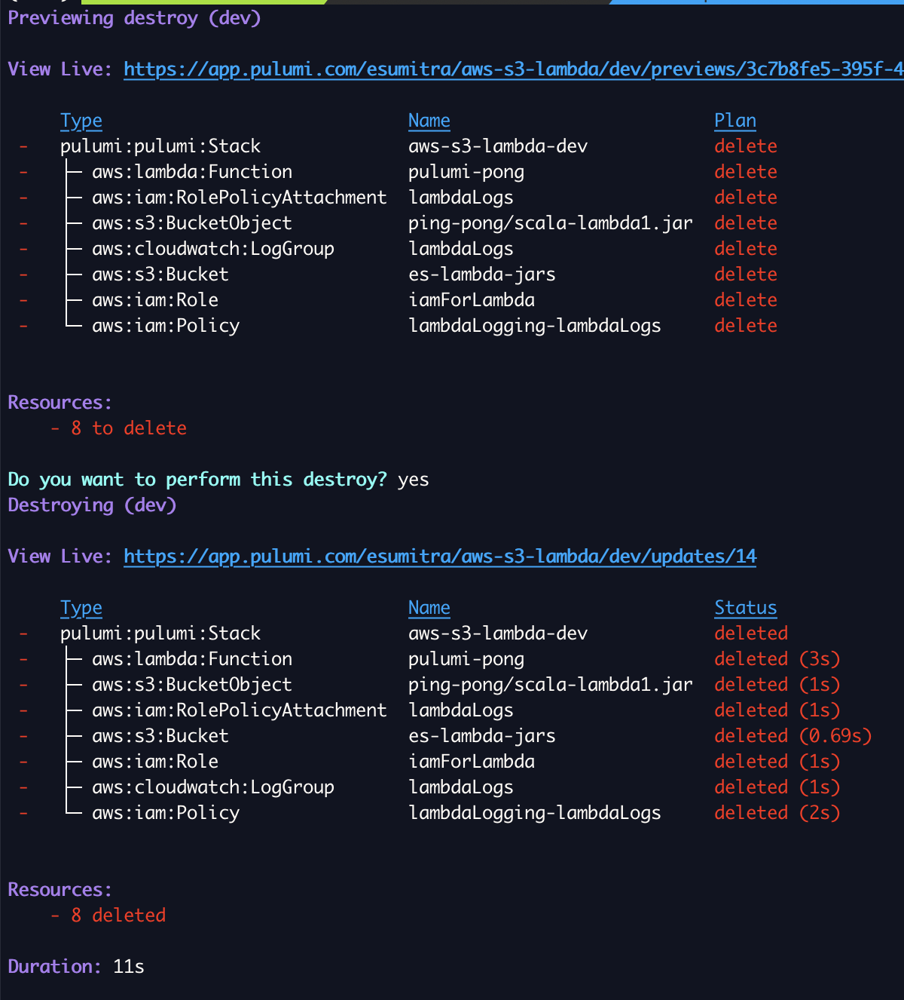

# A lambda function with code uploaded to AWS S3
The project contains the infrastructure code create and update a lambda function with code uploaded to S3

## Lambda Configuration
The following parameters need to be specified under the key `lambdaConfig` to create the lambda function

- **runtime**: The Lambda runtime to use e.g., nodejs16.x
- **handler**: Handler function in the form <namespace>.<function name>.  E.g., example.hello
- **logGroup**: Name of Cloudwatch group for lambda logs
- **lambdaPackage**: One of localZipFile or s3ZipFile
- **localZipFile**: Path to local zip file to be uploaded. Use this option for smaller size lambda packages under 50MB zipped.
- **s3ZipFile.bucketName**: Path to S3 bucket name for lambda resources
- **s3ZipFile.path**: S3 key to store the zip package as inthe S3 bucket
- **s3ZipFile.localZipFile**: Path to local zip file to upload to S3 bucket for lambda resources
 
## Configure the lambda function 
1. Set the site configuration parameters using the commands below

To configure pulumi, update the `Pulumi.<stack>.yaml` file. A sample configuration is shown below

```
config:
  aws:region: us-east-1
  aws-s3-lambda:lambdaConfig:
    name: 'pulumi-pong'
    runtime: 'java11'
    handler: 'com.example.lambda.PingPongHandler::handle'
    logGroup: lambdaLogs
    timeout: 180 # 3 minutes
    lambdaPackage:
      type: 's3Source'
      s3ZipFile:
        bucketName: 'es-lambda-jars'
        path: 'ping-pong/scala-lambda1.jar'
        localZipFile: './scala-lambda1.jar'
```

Common runtimes are `nodejs16.x | java11 | python3.9`. Valid values of the runtime can be found at https://docs.aws.amazon.com/lambda/latest/dg/API_CreateFunction.html#SSS-CreateFunction-request-Runtime

Verify configuration using

```
pulumi config get 'lambdaConfig'
```

2. Create bucket and file 

Run `pulumi up` and select yes

Sample output

[](./images/pulumi-create.png)

Verify content using
```
curl $(pulumi stack output bucketEndpoint)
```


3. Update content
Run `pulumi up` and select yes

Sample output
[](./images/pulumi-update.png)


4. Delete Infrastructure
Run `pulumi destroy` and select yes

Sample output

[](./images/pulumi-destroy.png)

## Infrastructure Setup Steps

1. Create the IAM role for the lambda function
2. Create log resources for the lambda function
3. Create the lambda function

- a.  If small (< 50MB) file, create the lambda function directly
   
- b. If package is large ( > 50MB),
     - First create the S3 bucket and upload local package to S3 bucket

     - Then create the lambda function with the S3 package resource uploaded


## License
Copyright 2023, Edward Sumitra

Licensed under the MIT License.
