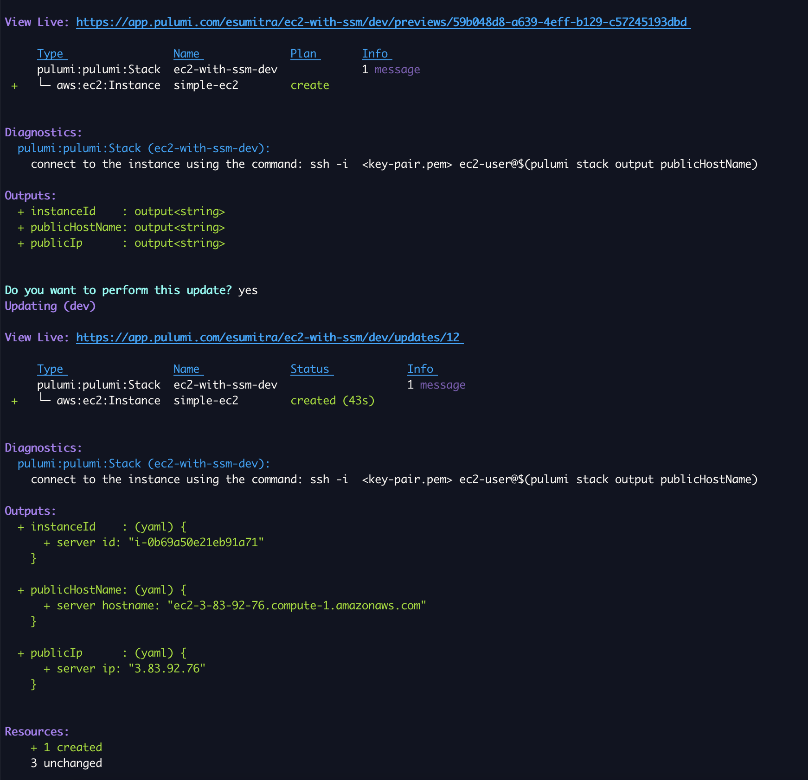
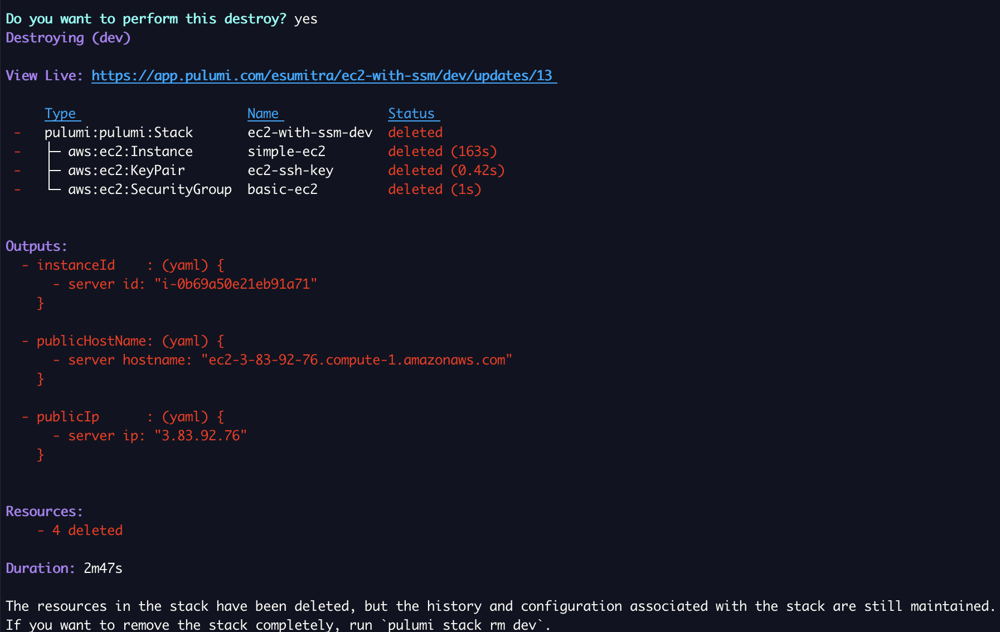

# An AWS EC2 instance with Linux
The project contains the infrastructure code to create a Linux EC2 instance

## Create and update Infrastructure
1. Create EC2 instance from AMI

Run `pulumi up` and select yes

Sample output
```
 publicHostName: "ec2-18-212-35-35.compute-1.amazonaws.com"
    publicIp      : "18.212.35.35"
    instanceId    : "i-041860798a6799a5f"
```

[](./images/pulumi-create.png)


1. Login to the instance using
```
ssh -i  <key-pair.pem> ec2-user@$(pulumi stack output publicHostName)
```

2. Delete Infrastructure
Run `pulumi destroy` and select yes

Sample output

[](./images/pulumi-destroy.png)

## Infrastructure Setup Steps
1. Pre-requisite: Create SSH Key pair
2. Configure EC2 instance properties
2. Create security group with ssh access
3. Create EC2 instance

## License
Copyright 2022, Edward Sumitra

Licensed under the MIT License.
