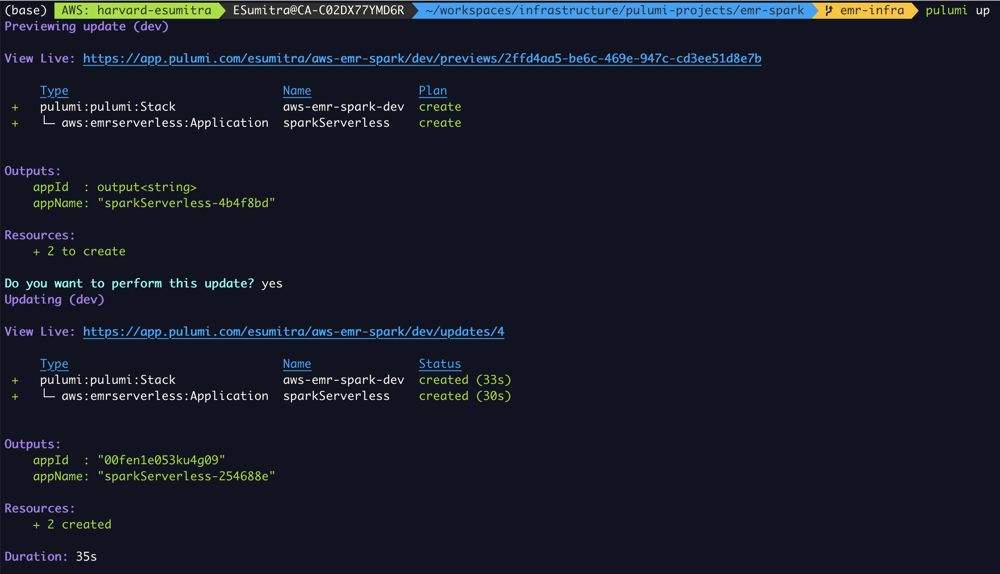
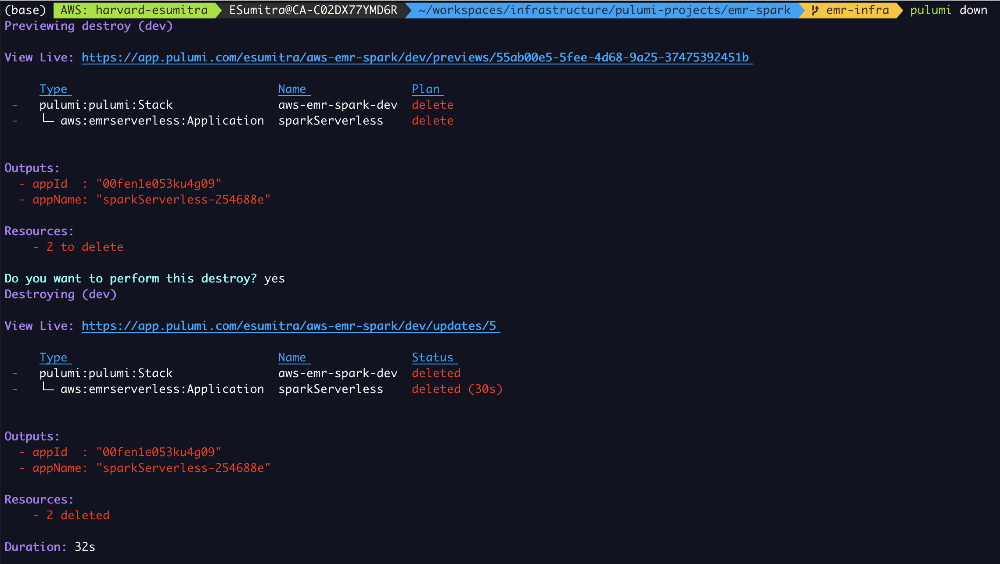

# A project to create an EMR Serverless infrastructure for Spark
The project contains the infrastructure code create an EMR Serverless infrastructure to run Spark jobs in the cloud. A pre-step to using EMR Serverless is to create an instance of EMR Studio. See [EMR Serverless.](https://us-east-1.console.aws.amazon.com/emr/home?region=us-east-1#/serverless)

## EMR Configuration
The following parameters need to be specified under the key `emrConfig` to create the emr cluster.
See configuration options at [Pre-Initialized Capacity](https://docs.aws.amazon.com/emr/latest/EMR-Serverless-UserGuide/application-capacity.html)

- **name**: Name of the spark application
- **appVersion.type**: One of 'spark' | 'hive'
- **appVersion.releaseLabel**: Version of EMR to use. E.g., "emr-6.12.0"
Initial capacities for Driver (master) node and Executor (worker) nodes defined with:
- **initialCapacityType**: Type of node. One of 'Driver' | 'Executor'
- **initialCapacityConfig.workerConfiguration.cpu**: Number of CPUs for the node. E.g., "2vCPU"
- **initialCapacityConfig.workerConfiguration.memory**: Memory for the node
- **initialCapacityConfig.workerCount**: Number of nodes of this type

 
## Configure the Spark Cluster
Set the cluster configuration parameters using the commands below.

To configure pulumi, update the `Pulumi.<stack>.yaml` file. A sample configuration is shown below

```
config:
  aws:region: us-east-1
  aws-emr-spark:emrConfig:
    name: "sparkServerless"
    appVersion:
      type: "spark"
      releaseLabel: "emr-6.12.0"
    initialCapacities:
    - initialCapacityType: "Executor"
      initialCapacityConfig:
        workerConfiguration:
          cpu: "2vCPU"
          memory: "10GB"
        workerCount: 2
    - initialCapacityType: "Driver"
      initialCapacityConfig:
        workerConfiguration:
          cpu: "2vCPU"
          memory: "4GB"
        workerCount: 1
```

Common release verions are `EMR Serverless 6.12.0`. For more details see https://docs.aws.amazon.com/emr/latest/EMR-Serverless-UserGuide/release-versions.html

Verify configuration using

```
pulumi config get emrConfig | jq
```

2. Create emr cluster 

Run `pulumi up` and select yes

Sample output

[](./images/pulumi-up.png)


3. Delete Infrastructure
Run `pulumi destroy` and select yes

Sample output

[](./images/pulumi-down.png)

## Infrastructure Setup Steps
- Presteps:
  - Create an instance of EMR Studio
  - Create an IAM role for serverless Spark jobs. Reference the IAM job role arn.

- Create the EMR Serverless application

## Running Spark Jobs on the EMR Serverless Application
The steps to run a spark job on the EMR Serverless application using the aws CLI are

1. Define the applicationId and jobRoleArn
```
export EMR_APP_ID=xxx
export EMR_JOB_ROLE_ARN=arn:aws:iam::xxx
```
2. Create the job
```
aws emr-serverless start-job-run \
    --application-id $EMR_APP_ID \
    --execution-role-arn $EMR_JOB_ROLE_ARN \
    --name wordCountPython \
    --job-driver '{
        "sparkSubmit": {
          "entryPoint": "s3://es-emr-data/scripts/wordcount.py",
          "entryPointArguments": ["s3://es-emr-data/emr-serverless-spark/input", "s3://es-emr-data/emr-serverless-spark/output"],
          "sparkSubmitParameters": "--conf spark.executor.cores=2 --conf spark.executor.memory=4g --conf spark.driver.cores=1 --conf spark.driver.memory=4g --conf spark.executor.instances=1"
        }
    }'

export EMR_JOB_RUN_ID=xxx

```
3. Monitor the job status
```
aws emr-serverless get-job-run \
    --application-id $EMR_APP_ID \
    --job-run-id $EMR_JOB_RUN_ID | jq '.jobRun.state'
```


## License
Copyright 2023, Edward Sumitra

Licensed under the MIT License.