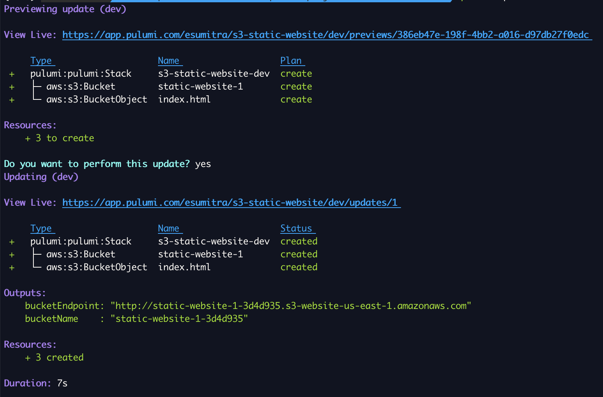
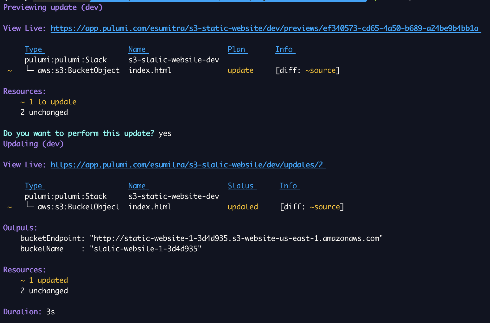
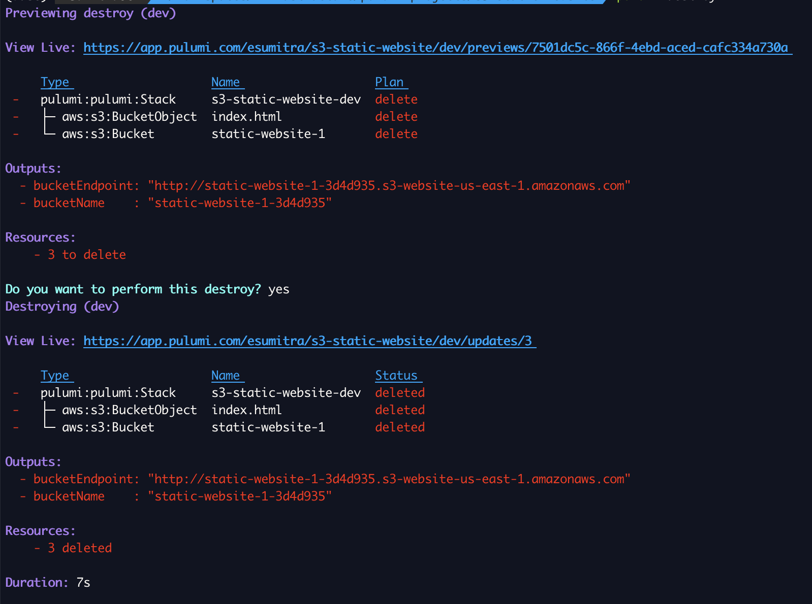

# A static website hosted in AWS S3
The project contains the infrastructure code to host a static website in an S3 bucket.

## Site Configuration
The following parameters need to be specified under the key `siteConfig` to create the static website

- **bucketName**: Name of the bucket to create. A unique identifier suffix is added to the name
- **indexDocument**: index HTML document to the website. This is typically named `index.html`.
- **srcFolder**: Path to the local source folder to upload content. All files and sub folders under the source folder will be uploaded to the bucket
 
## Create and update 
1. Set the site configuration parameters using the commands below

```
pulumi config set --path 'siteConfig.bucketName' 'static-website-1'
pulumi config set --path 'siteConfig.srcFolder' './dist'
pulumi config set --path 'siteConfig.indexDocument' 'index.html'
```

Verify configuration using

```
pulumi config get 'siteConfig'
```

2. Create bucket and file 

Run `pulumi up` and select yes

Sample output

[](./images/pulumi-create.png)

Verify content using
```
curl $(pulumi stack output bucketEndpoint)
```


3. Update content
Run `pulumi up` and select yes

Sample output
[](./images/pulumi-update.png)


4. Delete Infrastructure
Run `pulumi destroy` and select yes

Sample output

[](./images/pulumi-destroy.png)

## Infrastructure Setup Steps
1. Create a bucket with wesite configuration
2. For each file in target folder,
   
   if folder, recurse into folder

   if file, create a bucket object with content from source file

## License
Copyright 2023, Edward Sumitra

Licensed under the MIT License.
